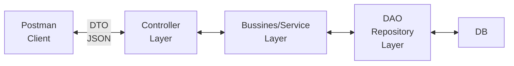
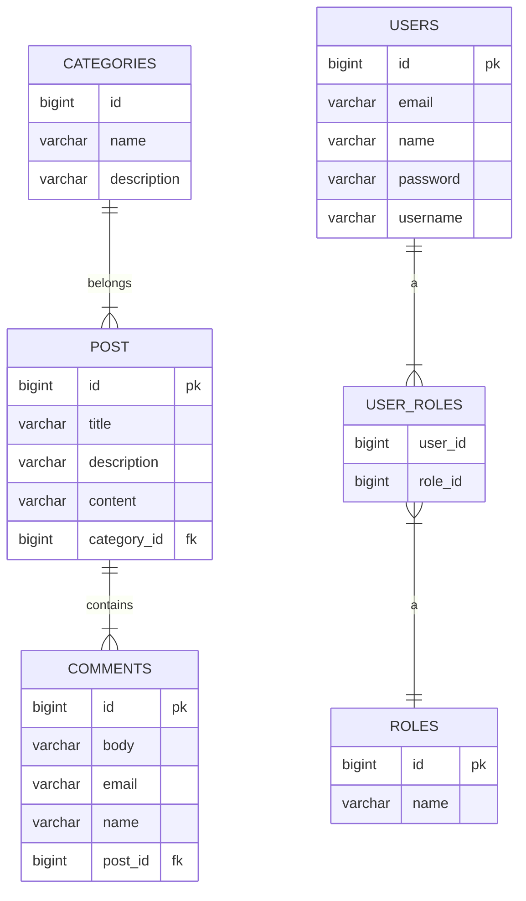

# Blog App
## Requirements
1. Post Management - CRUD posts with pagination and sorting support.
2. Comments Management - CRUD comments for posts.
3. Authentication and Authorization - Register, Login and Security.
	1. Secure using database authentication.
	2. Build Login/SignIn
	3. Build Register/SingUp
	4. Use JWT based authentication
	5. Implement Role-based security for admin and user roles
4. Category Management - CRUD categories.
5. Exceptions Handling and Validations
6. Versioning using different strategies.

## Technology stack
- Java platform: Java 17+
- Java Frameworks: Spring
- Token Based Authentication: JWT
- Build Tool: Maven
- IDE: Eclipse with STS
- Server: Tomcat embedded server
- Database: MySQL database
- REST Client: Postman

## Resources
- Post
	- CRUD
	- Pagination and Sorting
- Comment
	- CRUD
	- One post to Many comments mapping
- User
	- Register and Login
	- JWT
- Category
	- CRUD

## Architecture

## Project Structure
- Main
	- Controller
	- Configs
	- Dto
	- Entity
	- Exception
	- Repository
	- Service
		- Implementation
	- Security
	- Utils
		- ModelAssembler

## Data base

